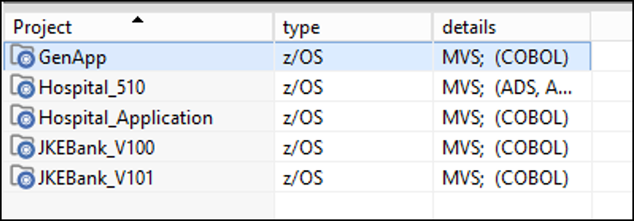

### Easy COBOL Code Insights

## Introduction
Enterprise applications are made up of so many pieces that even if each piece is very simple, the end-to-end flow quickly becomes complicated.  Then there are additional levels on top of execution flow, like the data model -- what data is being used, where is it updated, where is it changed, etc.  Enterprise applications aren't for the faint faint of heart.  Luckily, we can apply technology to these complicated solutions to make them easier for Developers to understand, and thus maintain.

This tutorial will introduce you to this type of technology using a sample COBOL application.

## Prerequisites
- The ability to connect to a lab environment via Remote Desktop Protocol.
- An understanding of COBOL is not neccesary but my be helpful.
- No back-end systems or front-end applications are necessary; everything is hosted in the lab environment.

## Estimated Time
It should take about xx minutes to complete this tutorial.

## Steps
1. Provision a lab environment. 
The software we're going to use in the tutorial consists of both front-end and back-end systems.  Everything can be self-provisioned using the following [IBM Z software trial](https://www.ibm.com/account/reg/signup?formid=urx-32638).  All you will need is an IBM ID to sign up for the trial.  After signing up you will immediately receive an e-mail thanking you for signing up.  Once your private lab environment is set up, you will receive a second e-mail with connection details.

1. Connect to your lab environment's desktop. 
Connect to your lab by following the instructions in the second e-mail.  We're going to use the Microsoft Remote Desktop application and the IP address, username, and password provided in the e-mail.  Once you're connected you should see the IBM Z Trial Program desktop.

1. Start the Z Trial wizard. 
This lab environment includes multiple self-paced scenarios.  To get started, click on the Z Trial Wizard icon in the lower-left of the screen (a hexagon with the letter Z in it).  After the wizard launches you should find a list of the available scenarios: 
 
Let's use the first scenario, `Assess and improve the maintainability of a COBOL application`.  The Wizard will cover additioanl material beyond what is covered in this tutorial.  Feel free to follow the Wizard's screens at your own pace.

1. Launch IBM Developer for z/OS 
Start IBM Developer for z/OS (IDz) by clicking its icon in the bottom-left of the screen.  This will launch the Application Discovery browser in IDz.  You should see a list of applications that have previously been defined; for this exercise we will use the `JKEBank_V100` application.

## Summary
xx

## Related Links
[IBM Z software trials](https://www.ibm.com/it-infrastructure/z/resources/trial)
[Application Discovery and Delivery Intelligence overview page](https://www.ibm.com/products/app-discovery-and-delivery-intelligence)
[IBM Developer for z/OS](https://www.ibm.com/us-en/marketplace/developer-for-z-systems)